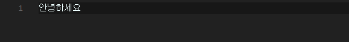
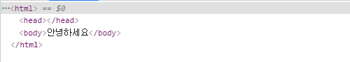
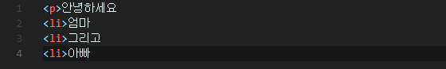
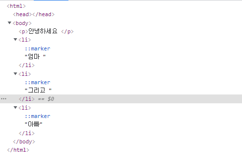
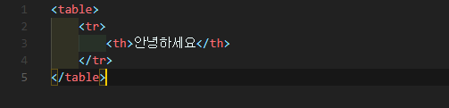
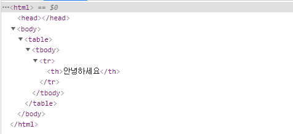

# DOM 트리

DOM에 따르면, 모든 HTML 태크는 객체입니다. 태그 하나가 감싸고 있는 ‘자식’ 태그는 중첩 태그(nested tag)

라고 부릅니다. 태그 내의 문자(text)역시 객체입니다. 이런 모든 객체는 자바스크립트를 통해 접근과 제어를 할수 있습니다.

```jsx
document.body.style.background = 'red'; // 배경을 붉은 색으로 변경 하기
```

`document.body` 는 `<body>` 태그를 객체로 나타낸 것입니다. 위를 실행 하게 되면 <body> 가 붉은 색으로 변경됩니다.

이 외에도 다양한 프로퍼티가 존재합니다.

- innerHTML - 해당 노드의 HTML 콘텐츠
- offsetWidth - 해당 노드의 너비(픽셀)
- 기타 등등

## DOM 구조

```html
<!DOCTYPE HTML>
<html>
<head>
  <title>인체의 신비</title>
</head>
<body>
  혈액 순환의 과정
</body>
</html>
```

DOM은 HTML을 트리 구조로 표현 합니다. 트리에 있는 노드는 모두 객체입니다.  

## 노드 타입

태그는 요소의 노드(element node) 이고, 트리 구조를 구성합니다. `<html>`은 루트 노드가 되고, `<head>`와 `<body>`는 루트노드의 자식이 됩니다.

요소 내의 문자는 텍스트 노드가 됩니다. 텍스트 노드는 문자열만 담습니다. 자식 노드를 가질수 없고, 트리의 끝에서 잎 노드(leaf node)가 됩니다. 

위 코드에서 `title` 태그는 “혈액 순환의 과정”라는 텍스트 노드를 자식으로 갖습니다.

텍스트 노드에 있는 특수문자

- 새 줄(newline)
- 공백(space)

**새 줄(newline)과 공백(space)은 글자나 숫자처럼 항상 유효한 문자로 취급**됩니다. 따라서 두 특수문자는 텍스트 노트가 되고, DOM의 일부가 됩니다.  위에 HTML을 보면 `<head>`와 `<title>` 사이에 새 줄과 약간에 공백이 있는 것을 볼 수있다. 이런 특수 문자는`#text` 노드가 됩니다.

텍스트 노드 생성의 뒤가지 예외

1. 역사적인 이유로, `<head>` 이전의 공백(space)과 새 줄(newline)은 무시됩니다.
2. HTML 명세서에서 모든 콘텐츠는 `body`안쪽에 있어야 한다고 했으므로, `</body>` 뒤에 무언가를 넣더라도 그 콘텐츠는 자동으로 `body` 안쪽으로 옮겨집니다. 따라서 `</body>` 뒤에는 공백이 있을 수 없습니다.

두 예외를 제외하면. 문서 내에 공백이 있다면 다른 문자와 마찬가지로 텍스트 노드가 됩니다. 공백을 지우면 텍스트 노드도 사라집니다.

공백이 없는 텍스트 노드만으로 HTML 문서를 구성하려면 HTML은 아래와 같이 많들어야 합니다.

```html
<!DOCTYPE HTML>
<html><head><title>인체의 신비</title></head><body>혈액 순환의 과정</body></html>
```

<blockquote>
💡 문자열 양 끝 공백만 있는 텍스트 노드는 개발자 도구에서 보이지 않습니다.
</blockquote>

**주석도 DOM을 구성합니다.**

주석 노드(comment node)는 #comment 로 표현되는 노드입니다.

주석 노드는 HTML에 있다면 반드시 DOM 트리에 추가되어야 한다는 규칙 때문에 DOM에 추가된 것입니다.

실무에서 주로 보는 4가지 노드

- DOM의 ‘진입점’이 되는 문서(document)노드
- HTML 태그에서 만들어지며, DOM 트리를 구성하는 블로인 요소 노드(element node)
- 텍스트를 포함하는 텍스트 노드(text node)
- 화면에 보이지 않지만, 정보를 기록하고 JS를 이용해 이 정보를 DOM으로 읽을 수 있는 주석(comment) 노드

## 자동 교정

기형적인 HTML을 만나면 브라우저는 DOM 생성 과정에서 HTML을 자동으로 교정합니다.

예를들어 최상단에 `<html>` 이 없는 경우, 문서 최상단에 자동으로 `<html>`을 자동으로 넣어줍니다.

따라서 DOM에는 `<html>`에 대응하는 노드가 항상 존재합니다. `<body>` 도 같은 방식이 적용됩니다.





만약 HTML 파일에. “안녕하세요.” 라는 문장 하나만 저장된 상황이라면, 브라우저가 자동으로 이 문장을 `<html>`과 `<body>`로 감싸줍니다. 그리고 `<head>`도  생성됩니다. 

DOM 생성과정에서 브라우저는 문서에 있는 에러 등, 닫는 태그가 없는 경우 에러를 자동으로 처리됩니다.

<blockquote>
닫는 태그가 없는 경우
</blockquote>





닫는 태그가 없는 경우도 브라우저는 태그를 읽고, 자동으로 빠진 부분을 채워 넣어 줍니다.

<blockquote>
Table의 tbody
</blockquote>





DOM 명세서엔 테이블에 반드시 `<tbody>`가 있어야 한다고 못 박아 놓았지만 HTML에선

`<tbody>`를 생략하곤 합니다. 이때, 브라우저는 자동으로 DOM`<tbody>`를 만들어 줍니다.