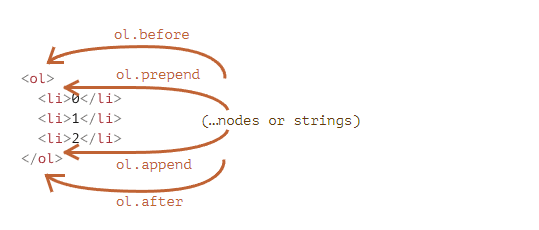

# 문서 수정하기

## 요소 생성하기

`document.createElement(tag)` 는 태그 이름을 이용해 새로운 요소 노드를 만듭니다.

`doucment.createTextNode(text)`를 사용해 새로운 텍스트 노드를 만듭니다.

## 삽입 메서드

태그를 페이지에 나타나개 하려면 document 내 어딘가에 태그를 넣어줘야 합니다.

요소를 삽입 메소드  `append`를 사용한 코드 `document.body.append(’tag’)`를 사용해 직접 새롭게 만든 요소를 페이지에 나타나도록 할 수 있습니다.

```html
<script>
  let div = document.createElement('div');
  div.className = "alert";
  div.innerHTML = "<strong>안녕하세요!</strong> 중요 메시지를 확인하셨습니다.";

  document.body.append(div);
</script>
```

자바스크립트에서는 append 말고도 노드 삽입 메소드를 지원합니다. 해당 메소드는 아래와 같습니다.

- `node.append(노드나 문자열)` – 노드나 문자열을 `node` *끝*에 삽입합니다.
- `node.prepend(노드나 문자열)` – 노드나 문자열을 `node` *맨 앞*에 삽입합니다.
- `node.before(노드나 문자열)` –- 노드나 문자열을 `node` *이전*에 삽입합니다.
- `node.after(노드나 문자열)` –- 노드나 문자열을 `node` *다음*에 삽입합니다.
- `node.replaceWith(노드나 문자열)` –- `node`를 새로운 노드나 문자열로 대체합니다.



이 메소드를 사용하면 복수의 노드와 문자열을 한번에 넣을 수도 있습니다.

```html
<div id="div"></div>
<script>
  div.before('<p>안녕하세요</p>', document.createElement('hr'));
</script>
```

### insertAdjacentHTML/Text/Element

`elem.insertAdjacentHTML(where, html)` 은 태그가 정상적으로 동작할 수 있게 문자열 형태의 'HTML 

그 '자체’를 삽입할 수 있다.

`elem.insertAdjacentHTML(where, html)`에서 첫 번째 매개변수는 `elem`을 기준으로 하는 상대 위치로, 다음 값 중 하나 여야 합니다.

`**where`에 들어갈 인자는 아래와 같습니다.**

- `'beforebegin'` – `elem` 바로 앞에 `html`을 삽입합니다.
- `'afterbegin'` – `elem`의 첫 번째 자식 요소 바로 앞에 `html`을 삽입합니다.
- `'beforeend'` – `elem`의 마지막 자식 요소 바로 다음에 `html`을 삽입합니다.
- `'afterend'` – `elem` 바로 다음에 `html`을 삽입합니다.

**insertAdjacentHTML의 형제 매소드**

- `elem.insertAdjacentText(where, text)` – `insertAdjacentHTML`과 문법은 같은데, HTML 대신 `text`를 ‘문자 그대로’ 삽입한다는 점이 다릅니다.
- `elem.insertAdjacentElement(where, elem)` – 역시 같은 문법인데, 요소를 삽입한다는 점이 다릅니다.

`insertAdjacentText`과 `insertAdjacentElement`는 메서드 구색을 갖추려는 목적으로 만들어졌습니다.

### 노드 삭제

`node.remove()` 사용하면 노드를 삭제할 수 있습니다. 요소 노드를 다른 곳으로 *옮길 때* 기존에 있던 노드를 지울 필요가 없습니다.

**모든 노드 삽입 메서드는 자동으로 기존에 있던 노드를 삭제하고 새로운 곳으로 노드를 옮기기 때문입니다.**

## 노드 복제

`elem.cloneNode(true)`을 호출하면 `elem`의 ‘깊은’ 복제본이 만들어집니다. 

속성 전부와 자손 요소 전부가 복사 됩니다. `elem.cloneNode(false)`을 호출하면 후손 노드 복사 없이 `elem`만 복제됩니다.